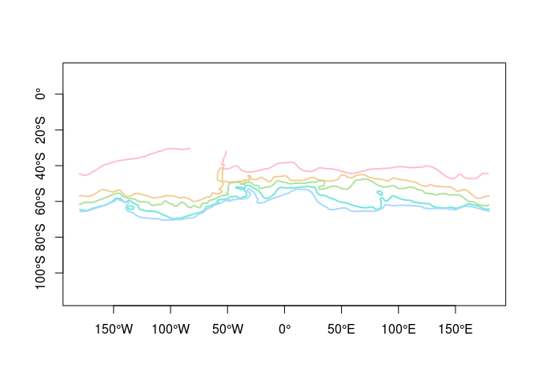
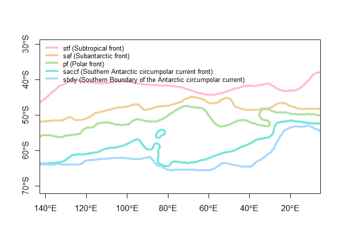

<!-- README.md is generated from README.Rmd. Please edit that file -->
Orsi fronts in Spatial form
---------------------------

The "Orsi fronts" are a commonly used climatological map of Southern Ocean frontal distributions, published on the [Southern Ocean Atlas Database Page](http://woceatlas.tamu.edu/Sites/html/atlas/SOA_DATABASE_DOWNLOAD.html) after Orsi et al. (1995).

The data is provided in this package as a built-in data set. The object `orsifronts` is a 'SpatialLinesDataFrame' object, as defined in the 'sp' package. (A 'SpatialLinesDataFrame' is a "GIS vector" layer where complex line geometry objects are linked to simple attribute data in a table form, and it behaves like a 'data.frame').

``` r
library(orsifronts)
#> Loading required package: sp
cols <- hcl(seq(0, 240, length = nrow(orsifronts)), c = 50)
plot(orsifronts, col = cols, lwd = 2)
degAxis(1)
degAxis(2)
box()
```



There are 5 line objects, with some simple names and codes.

``` r
as.data.frame(orsifronts)
#>                                                         name front
#> stf                                        Subtropical front   stf
#> saf                                       Subantarctic front   saf
#> pf                                               Polar front    pf
#> saccf           Southern Antarctic circumpolar current front saccf
#> sbdy  Southern Boundary of the Antarctic circumpolar current  sbdy
plot(orsifronts, xlim = c(60, 180), col = cols, asp = 1/cos(55 * pi / 180), lwd = 4)
legend("topleft", sprintf("%s (%s)", orsifronts$front, orsifronts$name),  col = cols, lwd = 4, cex = 0.8, bty = "n")
degAxis(1)
degAxis(2)
box()
```



References
==========

Orsi, A. H., T. Whitworth III and W. D. Nowlin, Jr. (1995). On the meridional extent and fronts of the Antarctic Circumpolar Current, Deep-Sea Research I, 42, 641-673.
